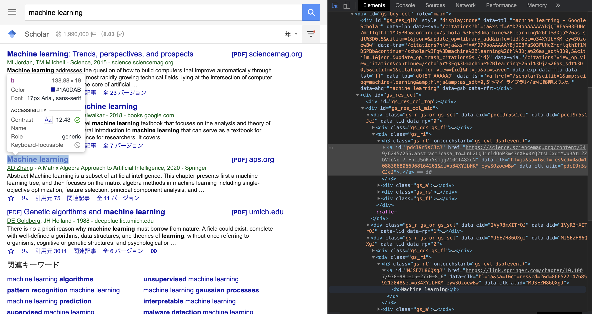

---

## 『バズってる』の見える化
### 研究プロジェクト演習
### 担当：横山昌平准教授

---

# 概要
国際会議の論文データやGoogle Scholarの論文データを利用し、興味がある論文や最近話題の論文を可視化するシステムの構築を目指した

---

# 環境構築
### 担当者：平尾、高橋

---

## 使用したサービス
- Github: チーム開発のコード管理
- Heroku: サービスの公開
- Firebase: データの保存・読み出し
- Streamlit: データの可視化
- Reveal.js: スライドの公開

---

## 全体像

---

## 公開ページ
- スライド: https://tmu-research-project-2020.github.io/slides

- ドキュメント: https://tmu-research-project-2020.github.io/documentation/

- サービスページ: https://gs-visualizer-production.herokuapp.com/

---

## 班構成
- インフラ班: 他サービスとの連携等を設定

（平尾、高橋）
- 入出力可視化班: データの可視化を行う

（伊藤、金、山下）
- スクレイピング班: データ収集を行う

（相田、海老根、住吉）

---

# 会議検索
### 担当者：平尾、高橋

---

## モチベーション

* 会議を限定して論文の検索を行いたい
* 会議によってページの構造異なるので検索が難しい
* 会議・年代を指定して検索できるようにした

---

## 可視化の流れ

1. 会議ごとに 2010-2020 間の論文タイトルを収集
2. 収集した論文タイトルと入力したキーワードの類似度のランキング作成

---

## 可視化を行った会議

* 画像：CVPR
* 自然言語処理：ACL, EMNLP, NAACL
* その他：NeurIPS, VLDB

---

## 類似度の計算

* pythonの標準ライブラリに入っている文字列の類似度を測定する[`difflib.SequenceMatcher`](https://docs.python.org/ja/3/library/difflib.html)を使用
* 中身のアルゴリズムは[Gestalt Pattern Matching](https://en.wikipedia.org/wiki/Gestalt_Pattern_Matching)
* ざっくり言うと最長共通部分列 / 全体の長さ

---

## ACLで「Attention Is All You Need」に対して出る論文

---

# Word Cloud, TF-IDFを用いた流行の可視化
### 担当者：伊藤、金、山下

---

## モチベーション
* バズってるの可視化
* 自分で見るのはめんどくさい
* 年ごとの傾向を一目で見たい！
* 年ごとのバズってるキーワードを可視化

---

## 可視化の流れ

1. 会議ごとに 2010-2020 間の論文タイトルを収集
2. 収集した論文タイトルを会議、年代ごとに word cloud, tf-idf で可視化

---

## 可視化を行った会議

* 画像：CVPR
* 自然言語処理：ACL, EMNLP, NAACL
* その他：NeurIPS, VLDB

---

## タイトルの前処理

* Lowercase
* Stop word (既存のものに論文タイトルに頻出する単語を追加 (例: training, via, など))

---

# 傾向

---

## Word Cloudの傾向

---

## TF-IDFの傾向

---

# レジェンド・バズ論文の可視化

### 担当者：相田、海老根、住吉

---

## モチベーション
**分野の初学者**に向けて、読んでおくべき2種類の論文を提案  
- **レジェンド論文**：年代を問わず重要な論文
- **バズ論文**：最近出版され、注目されている論文

---

## 概要

レジェンド論文、バズ論文は以下のように定義した
- レジェンド論文：単純なキーワード検索で上位に来る論文
- バズ論文：キーワード＋出版年の複合検索で上位に来る論文

各分野に関する任意のキーワードに対して、Google Scholar からスクレイピングを行い、論文の情報を集めた
- タイトル、URL、著者、出版年、出版元、引用数、引用推移 

得られた論文情報を可視化した

---

## 1. スクレイピング
Google Scholarのウェブサイトをスクレイピングし論文情報を取得、分析する
スクレイピングの処理は大きく2つに分けられる

1. PythonのHTTP通信ライブラリ**requests**を使用してGoogle ScholarのHTMLを取得
1. **BeautifulSoup**を使用して必要な情報を抽出し、csvに保存

---

### 1回のスクレイピングで取得できる情報
- タイトル
- URL
- 著者
- 出版年
- 出版元
- 引用数
- スニペット

---

## 2. ある論文を引用している論文、引用数の推移
対象論文発行年〜2021年間の年ごとの対象論文引用数を取得
- 引用論文の発行年を取得することで実現

後にでる、レジェンド論文、可視化論文の被引用推移を可視化するために使用

**被引用推移取得までの流れ**
1. 著者、キーワード、出版名、出版年を入力
1. url をリクエストし、上位10件を表示・対象論文を選択
1. 選んだ論文を引用している論文を上位100件検索
1. 論文の情報・各年の引用数の推移を抽出し、csv に出力

---

## 3. 複合キーワード検索
通常のキーワード検索だと**古い年代の有名な文献**が出てくる  

→検索の際に分野に関係のある**キーワード**だけではなく、  
**出版（会議）名**・**論文が公開された年**も指定したい  

---  

**複合条件**（キーワード・出版名・出版年）で検索できるように修正した（今後公開予定）
1. キーワード、出版名、出版年を入力
1. url をリクエストし、上位100件を検索
1. 論文の情報（タイトル、著者、出版年、引用数、url、スニペット）を抽出
1. csv に出力

---

## 4. 分野のレジェンド論文・バズ論文を可視化

---

得られた情報を**Web アプリ上に可視化**した

---

## まとめ
国際会議の論文データやGoogle Scholarの論文データを利用し、興味がある論文や最近話題の論文を可視化するシステムの構築した
- 会議ごとのキーワードに対する関連度を可視化
- 会議，年ごとの流行をword cloudで可視化
- 初学者が読んでおくべき2種類の論文を可視化

